### Контрольная работа №1

## Задание 1.1

Код:

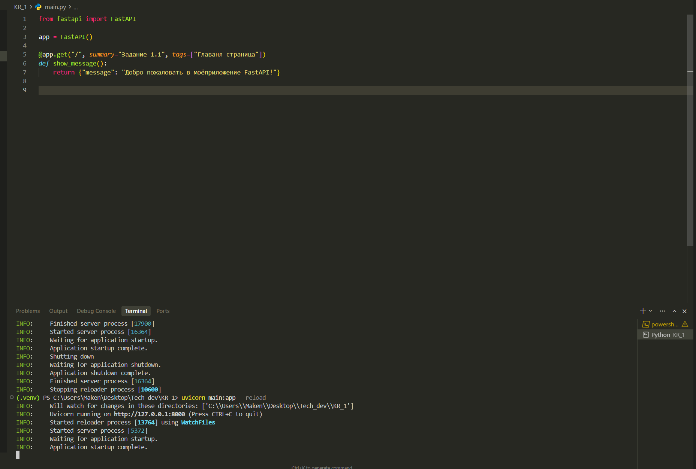

Результат:
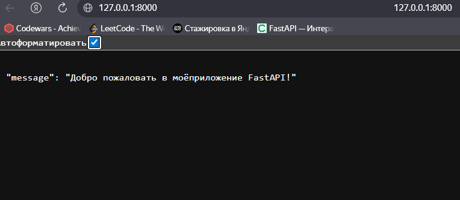

# Дополнительно

Код:

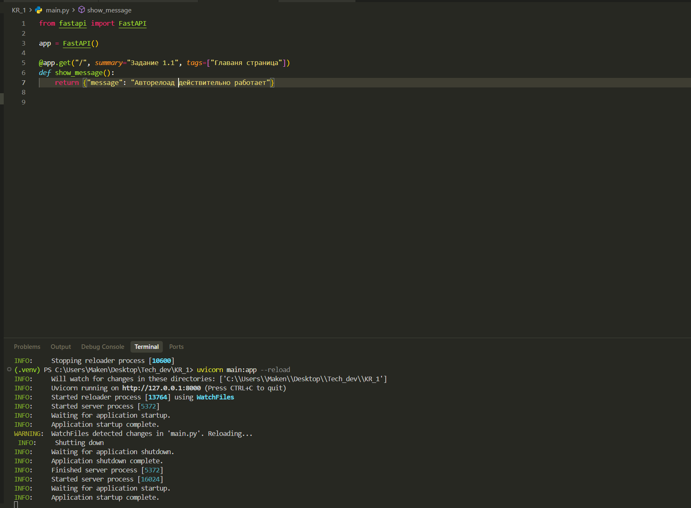

Результат:

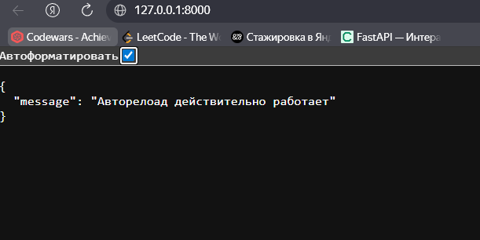

## Задание 1.2

Код:

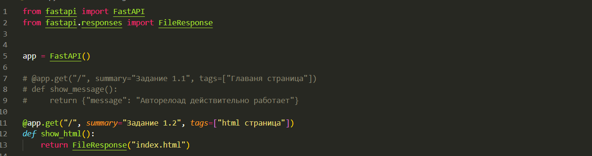

Результат:
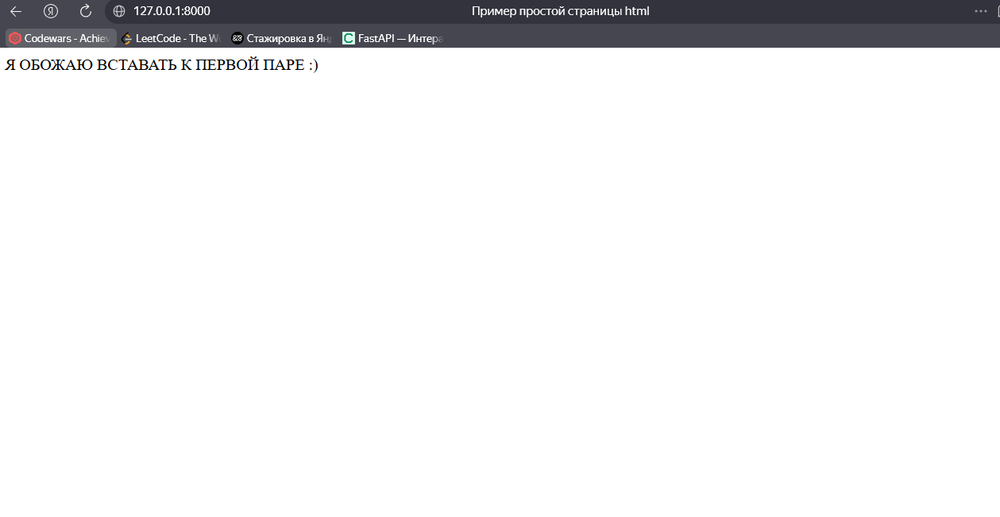

## Задание 1.3

Код:

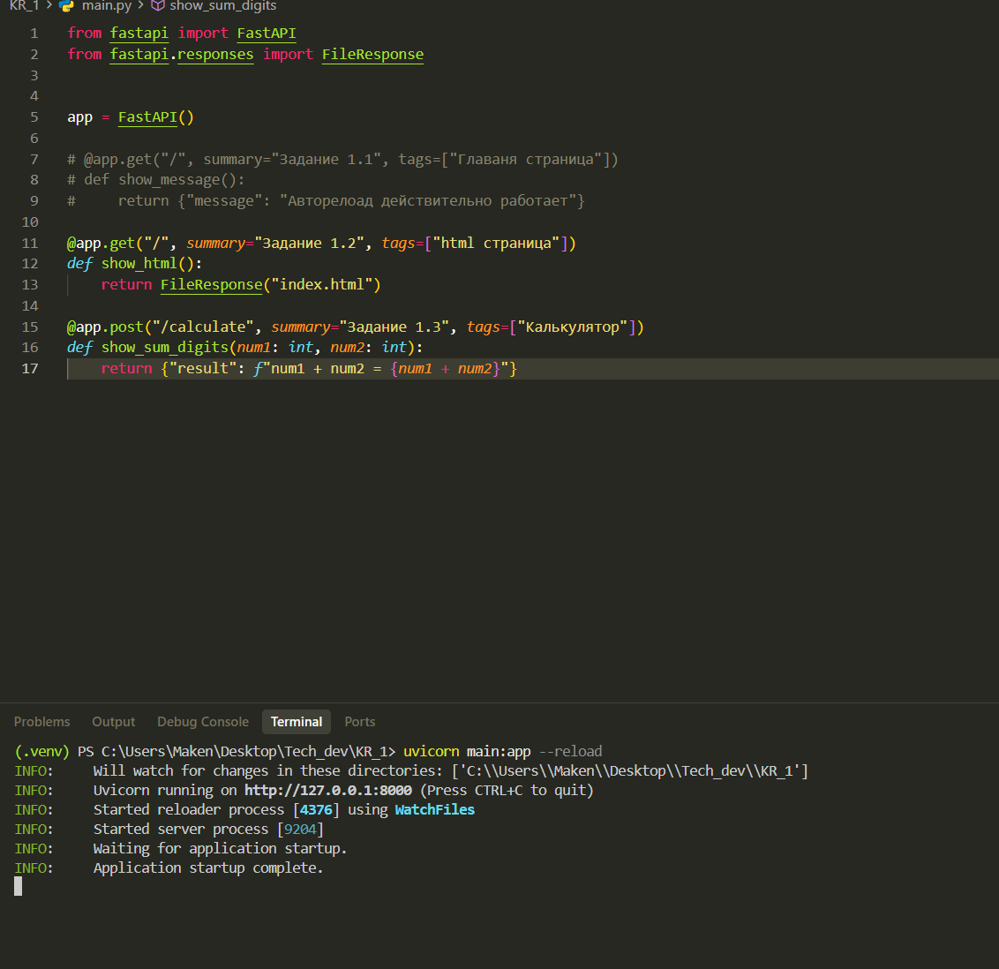

Результат:
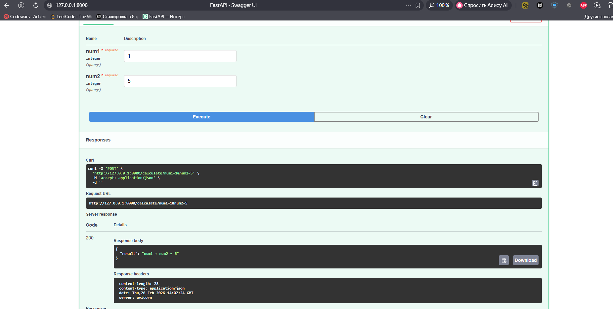

## Задание 1.4

Код: main.py

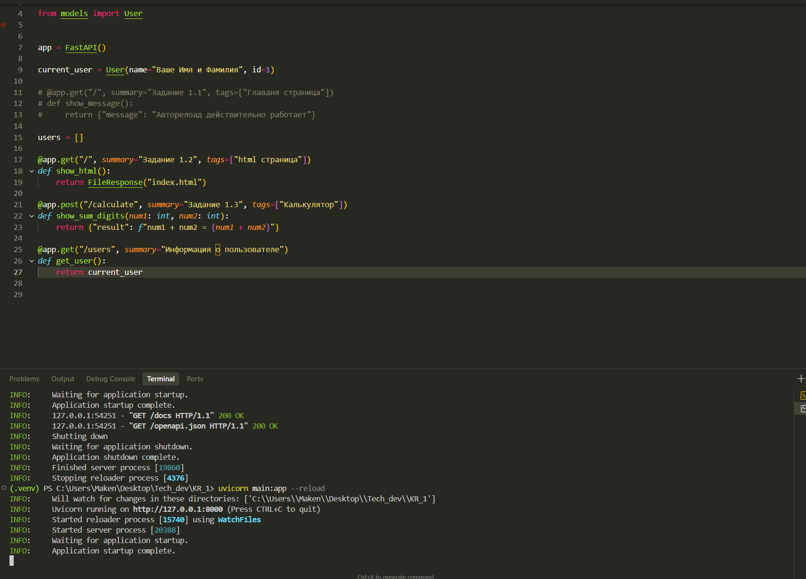

Код: models.py

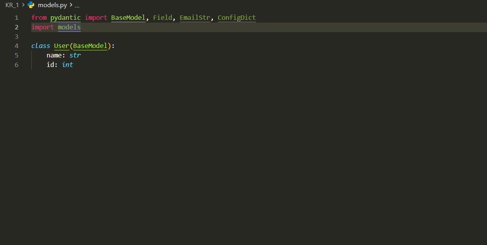

Результат:
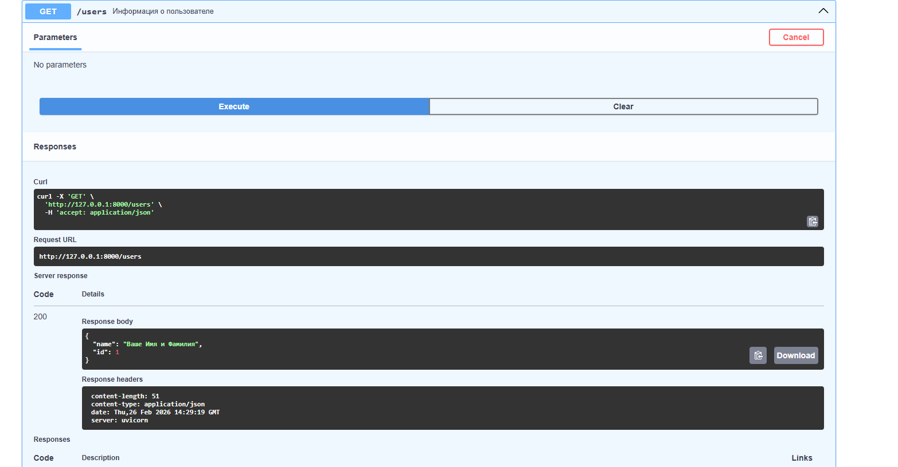

## Задание 1.5

Код: main.py

Код: models.py

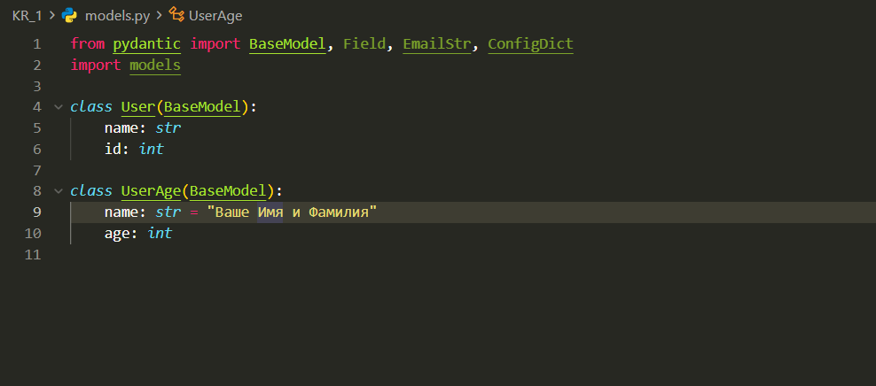

Результат:
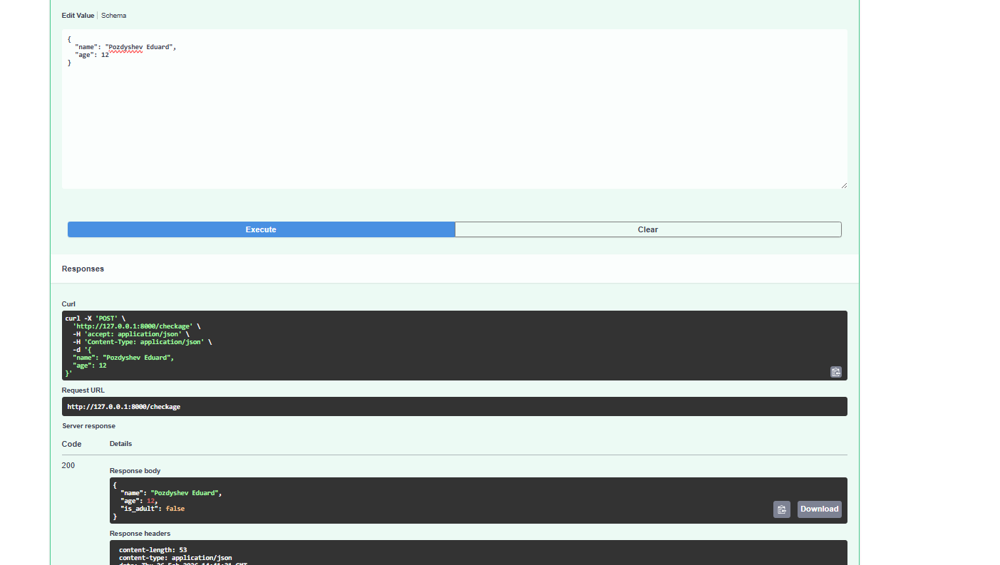

Результат:
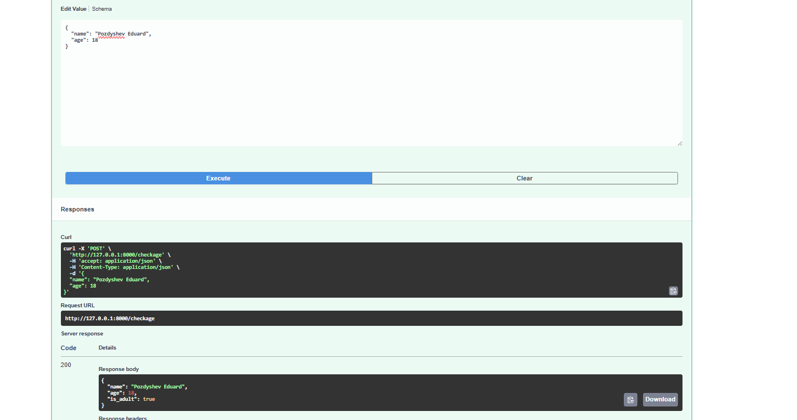

## Задание 2.1 - 2.2

Код main.py
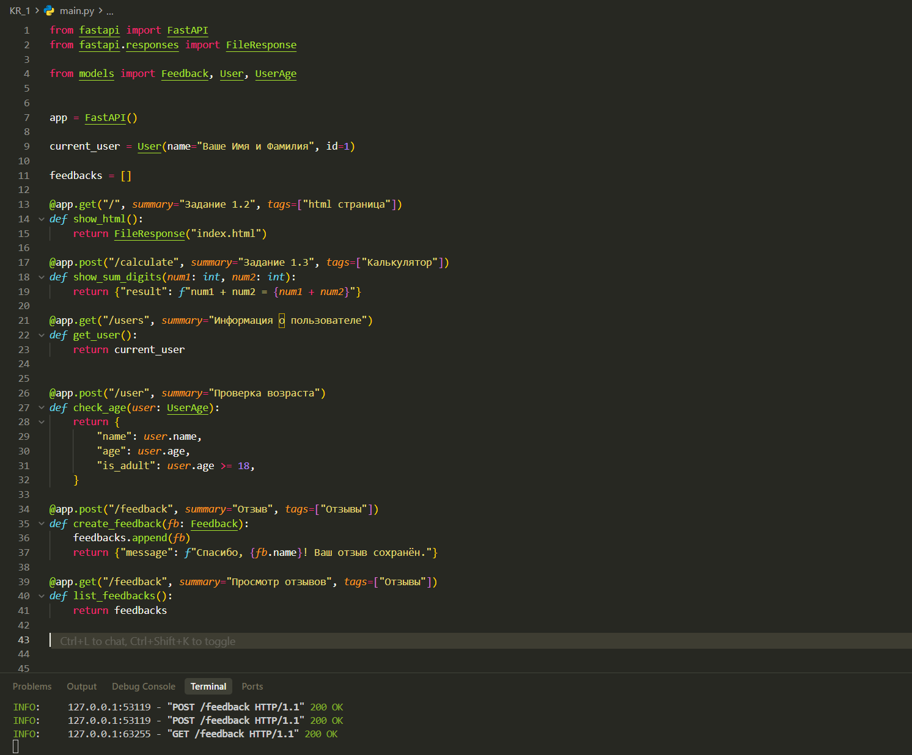

Код models.py
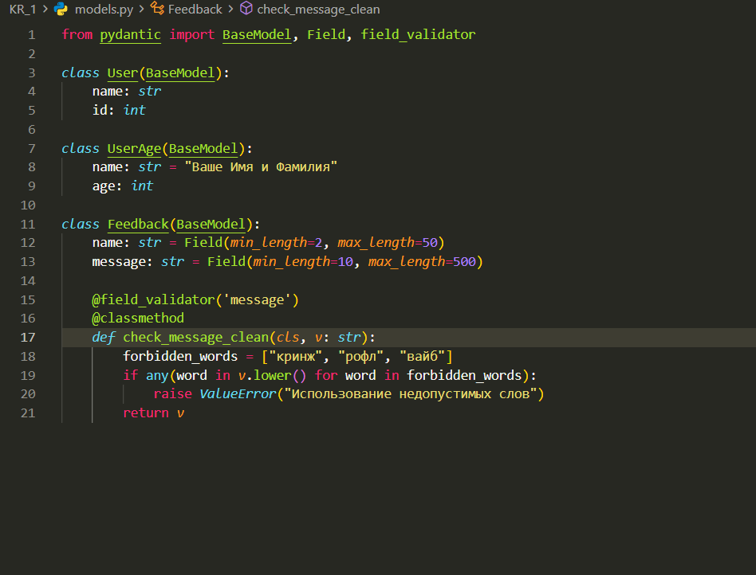

Результат
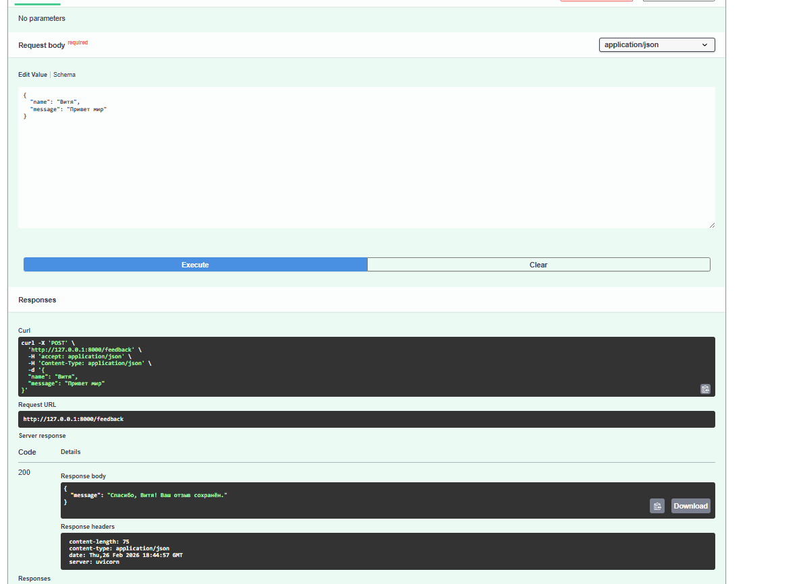
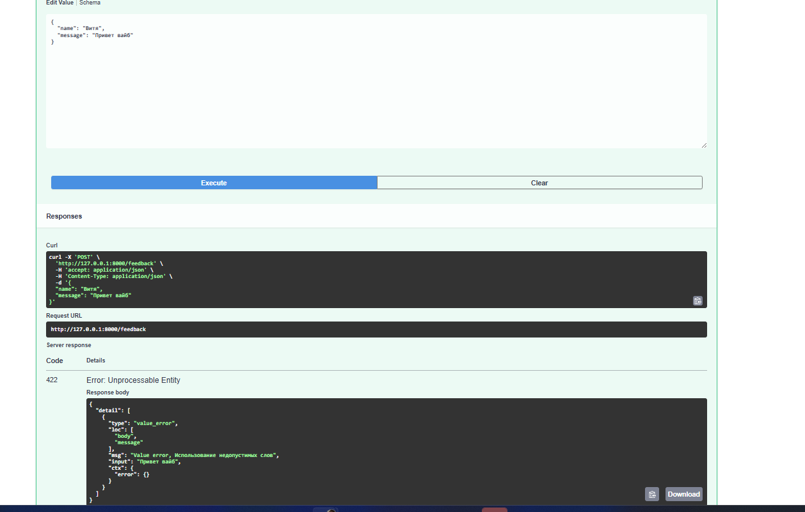
